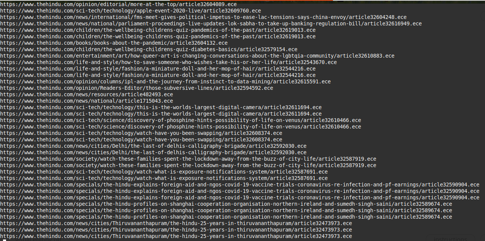

# newsLinks_Webscraper
Distraction free headlines (links) from News website

Two files are generated:
1. newsLinks.txt
2. newsLinksCleaned.txt

## Modification
For a different website set the variable newsWebsite to the link.
The cleaning of the extracted data can be changed using the clean_data function.

This is a very rudimentary code and ~~might~~ will have bugs. Feedback and criticism are welcomed and appreciated. 

### Acknowledgments
Thanks to Dr.Charles Severance (https://github.com/csev) for his wonderful book and accompanying lectures on python language (https://www.coursera.org/lecture/python/video-welcome-to-class-dr-chuck-GoNcs), because of which this mini-project was possible.
