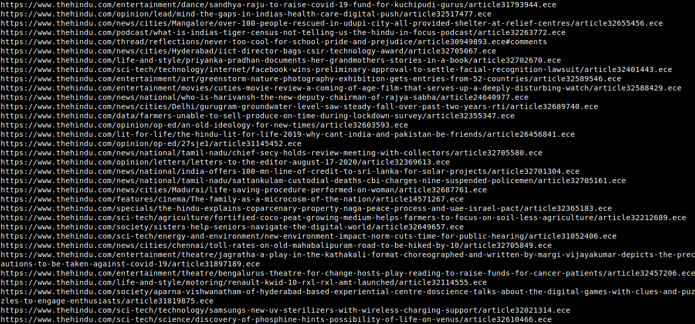

# newsLinks_Webscraper
Distraction free headlines (links) from News website

Two files are generated:
1. newsLinks.txt
2. newsLinksCleaned.txt

## Modification
For a different website set the variable newsWebsite to the link.
The cleaning of the extracted data can be modified using the clean_data function.

This is a very rudimentary code and might have bugs. Feedback and criticism is welcomed and appreciated. 
